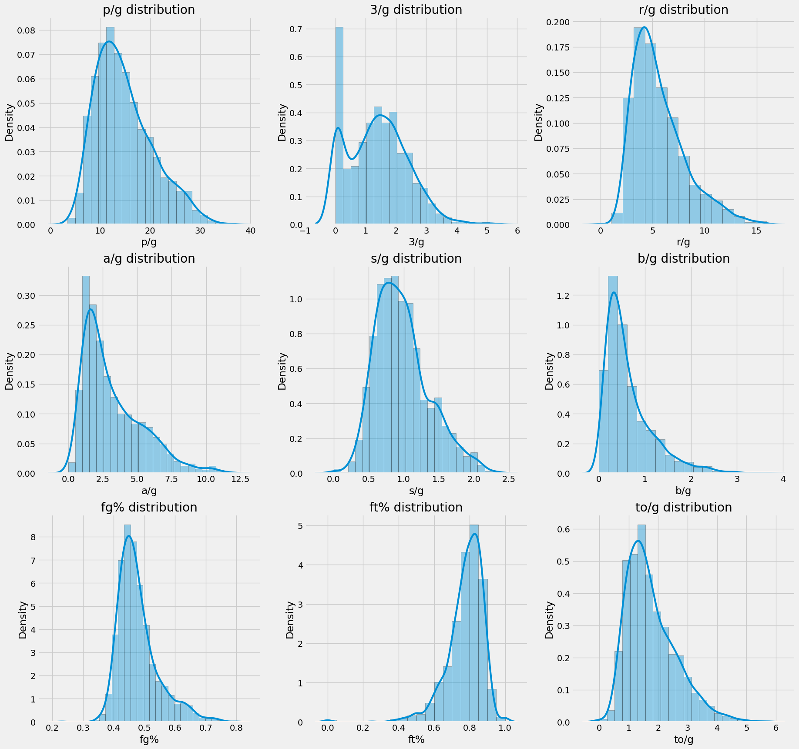
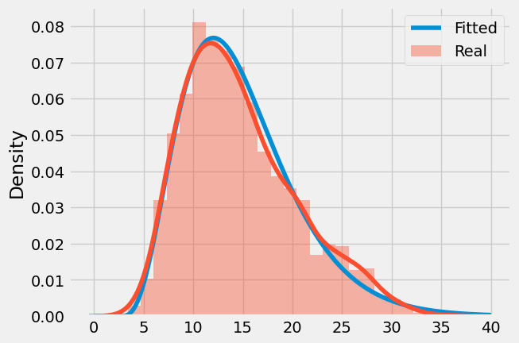

# CARUSO METRIC

## Socials
- ✖️ [Twitter](https://twitter.com/FHuzjan) 
- 💼 [LinkedIn](https://www.linkedin.com/in/franhuzjan/)

## Original distributions

**NBA Fantasy:** A source of pure joy and stress for most of us. If you're reading this, it means you're deep into it, and you probably know that there are two types of NBA Fantasy leagues: points and categories. Categories typically require more strategy and planning, making them the more popular choice, with the most popular being 9CAT league.

The categories are
- Points
- Three pointers
- Rebounds
- Assists
- Steals
- Blocks
- Turnovers
- Field goal percentage
- Free throw percentage

For the past 30 years or so, the golden standard for NBA fantasy category rankings has been the Z-score. Every year, we draft, rank, and evaluate players based on their Z-score ranking. But have you ever questioned how that rank is calculated? Probably not, just like myself.

I was listening to [Josh Lloyd's](https://twitter.com/redrock_bball) podcast, where he was discussing how the Z-score is calculated. It essentially assumes that the data distribution is Gaussian or Normal. I thought to myself, well, almost everything becomes normally distributed when the sample size is large enough, and in the NBA, we're dealing with thousands and thousands of shots, steals, blocks, and more.

Z-score is being calculated with the following formula:

Z = (X - μ) / σ

Where:
- Z is the Z-score,
- X is the value you want to standardize,
- μ is the mean (average) of the data,
- σ is the standard deviation of the data.

and the data is the values from all players for a specific category.

Okay, sounds good for now, but Josh said that the data is not normally distributed. I can't trust him blindly, so I decided to plot the main 9 categories for all top 180 players based on the traditional Z-score from the 2013/14 to the 2022/23 season, along with their distributions.

Well, well, it looks like he was right all along. None of this data resembles a Gaussian distribution. Maybe the Z-score isn't the best metric available. Perhaps that's why players like Delon Wright, Al Horford, and De'Anthony Melton had a higher rank than the 2x MVP Giannis Antetokounmpo in his highest-scoring season last year.

By the way, there's a really interesting tweet by Josh:

<blockquote class="twitter-tweet">
JJJ had a z score of 4.64 for blocks category last season. In a normally distributed set of data, someone being that far above is a 1 in about half a million proposition.
&mdash; Josh Lloyd (@redrock_bball) <a href="https://twitter.com/redrock_bball/status/1690974327620227072?ref_src=twsrc%5Etfw">August 14, 2023</a></blockquote> 

A player that averages 3.0 blocks per game should be THAT rare. There have been plenty of players in the past who have averaged even more. This could be the biggest inspiration for CARUSO.

## Idea for CARUSO

Inspired by one of my favorite, and also one of the most underrated players in the league, I've coined the name CARUSO metric, which stands for:

- **C** - Customized
- **A** - Adaptive
- **R** - Resourceful
- **U** - Unique
- **S** - Statistical
- **O** - Optimized

CARUSO is based on the H-score (instead of the Z-score). Similar to the classical approach, it calculates a score for each category and then takes the average across all categories, yielding the final CARUSO value. CARUSO also employs a machine learning algorithm to determine the best distribution and its parameters, aiming to minimize the mean squared error on the data.

	

<p, style="text-align: center;">
    <em>Example of one real distribution and the fitted distribution</em>

Once the optimal distribution is identified, the H-score can be calculated for every data point within it, involving basic statistics and mathematics.

## CARUSO interpretation

