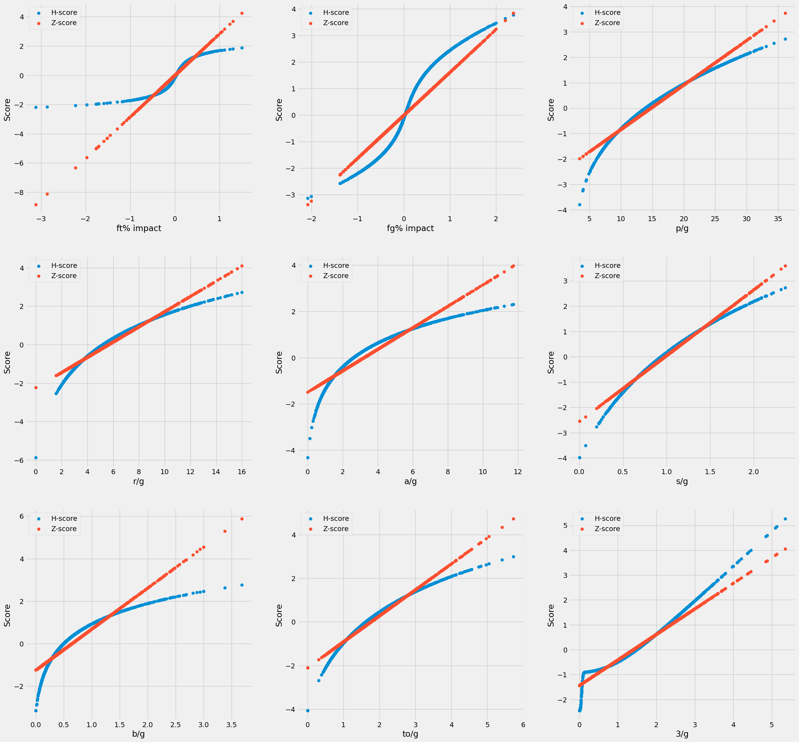
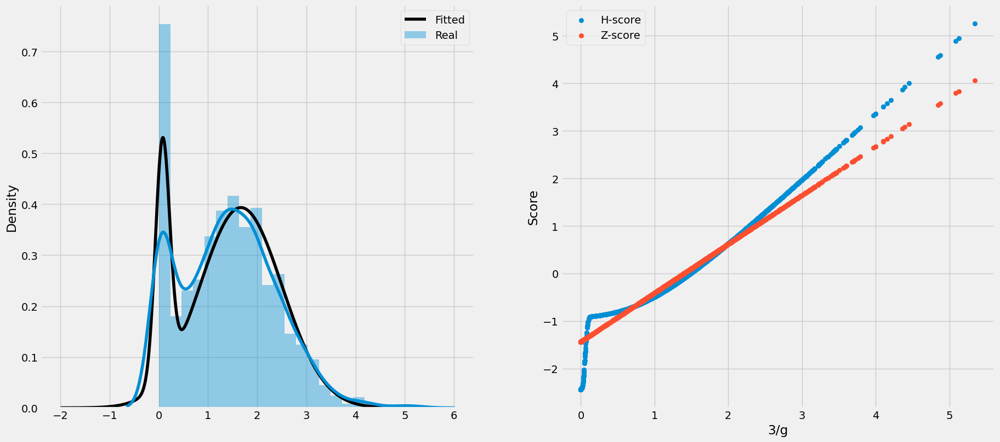
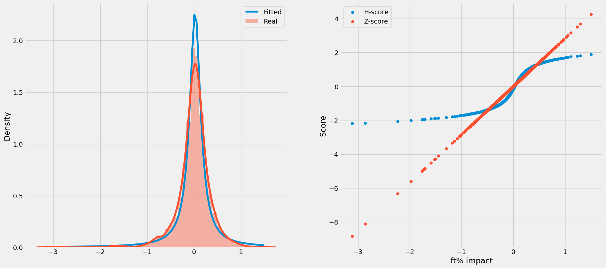

# CARUSO METRIC

## Socials
- ✖️ [Twitter](https://twitter.com/FHuzjan) 
- 💼 [LinkedIn](https://www.linkedin.com/in/franhuzjan/)

## Original distributions

**NBA Fantasy:** A source of pure joy and stress for most of us. If you're reading this, it means you're deep into it, and you probably know that there are two types of NBA Fantasy leagues: points and categories. Categories typically require more strategy and planning, making them the more popular choice, with the most popular being 9CAT league.

The categories are
- Points
- Three pointers
- Rebounds
- Assists
- Steals
- Blocks
- Turnovers
- Field goal percentage
- Free throw percentage

For the past 30 years or so, the golden standard for NBA fantasy category rankings has been the Z-score. Every year, we draft, rank, and evaluate players based on their Z-score ranking. But have you ever questioned how that rank is calculated? Probably not, just like myself.

I was listening to [Josh Lloyd's](https://twitter.com/redrock_bball) podcast, where he was discussing how the Z-score is calculated. It essentially assumes that the data distribution is Gaussian or Normal. I thought to myself, well, almost everything becomes normally distributed when the sample size is large enough, and in the NBA, we're dealing with thousands and thousands of shots, steals, blocks, and more.

Z-score is being calculated with the following formula:

Z = (X - μ) / σ

Where:
- Z is the Z-score,
- X is the value you want to standardize,
- μ is the mean (average) of the data,
- σ is the standard deviation of the data.

and the data is the values from all players for a specific category.

Okay, sounds good for now, but Josh said that the data is not normally distributed. I can't trust him blindly, so I decided to plot the main 9 categories for all top 180 players based on the traditional Z-score from the 2013/14 to the 2022/23 season, along with their distributions.

Well, well, it looks like he was right all along. None of this data resembles a Gaussian distribution. Maybe the Z-score isn't the best metric available. Perhaps that's why players like Delon Wright, Al Horford, and De'Anthony Melton had a higher rank than the 2x MVP Giannis Antetokounmpo in his highest-scoring season last year.

By the way, there's a really interesting tweet by Josh:

<blockquote class="twitter-tweet">
JJJ had a z score of 4.64 for blocks category last season. In a normally distributed set of data, someone being that far above is a 1 in about half a million proposition.
&mdash; Josh Lloyd (@redrock_bball) <a href="https://twitter.com/redrock_bball/status/1690974327620227072?ref_src=twsrc%5Etfw">August 14, 2023</a></blockquote> 

A player that averages 3.0 blocks per game should be THAT rare. There have been plenty of players in the past who have averaged even more. This could be the biggest inspiration for CARUSO.

## Idea for CARUSO

Inspired by one of my favorite, and also one of the most underrated players in the league, I've coined the name CARUSO metric, which stands for:

- **C** - Customized
- **A** - Adaptive
- **R** - Resourceful
- **U** - Unique
- **S** - Statistical
- **O** - Optimized

CARUSO is based on the H-score (instead of the Z-score). Similar to the classical approach, it calculates a score for each category and then takes the average across all categories, yielding the final CARUSO value. CARUSO also employs a machine learning algorithm to determine the best distribution and its parameters, aiming to minimize the mean squared error on the data.

	

Once the optimal distribution is identified, the H-score can be calculated for every data point within it, involving basic statistics and mathematics.

## CARUSO Interpretation

I've provided a lot of information, but I've shown very few results. In the graphs below, you can see a comparison of H-score and Z-score.

Some of the main issues that CARUSO addresses include not overvaluing high values in sparse categories like steals and blocks. This is because, as the distribution itself shows (see the image with distributions above), these categories are not as rare as the traditional Z-score suggests.

### 3-Pointers

Let's delve into a specific case: 3-pointers. The unique aspect here is that it doesn't resemble a univariate distribution; instead, it exhibits **2** spikes. As a result, it can't be adequately fitted with the classic distribution and requires a Gaussian mixture model for accurate and logical predictions. You can see the fitted and real distributions on the left plot below.

The comparison of H and Z-score for 3-pointers is particularly fascinating. Because it's a multivariate distribution, and we have players who either take 3-pointers or don't take them at all, CARUSO penalizes players with low 3-pointers and also rewards the most extreme cases more than the traditional approach. This finding piqued my interest, because in my mind the players that don't score 3s at all should be punished more than players that score small volume of it. This finding will have a significant impact on the final player rankings.

### Percentages categories

The thing that gave me the most headache while trying to figure the CARUSO ranking were the percentages categories (FG% and FT%). Now I will use the FT% as an example, but it can be also applied to FG%. 
The issuse with them is that there is no clear interpretability which player is better:

- Player A that shoots FTs with 80% on 20 attemps
- Player B that shoots FTs with 87% on 3 attemps

Both players shoot above average FT%, but which one should score more? Let's turn to distributions once again (wohoo). 

First that that I did was took both the FT% and FT attemps per game, and tried to score both at the same time. Makes since right? Except it doesn't. In this approach the higher the FT% was, the higher the first part of the H-score will be (which is logical and it should work like that) and also the more the attemps the players has the second part of the H-score will be higher (which is pretty dumb, because of the next example). For example if a player A shoots 100 attemps/game on 50%, he will have a higher score than player B which shoots 70% on 2 attemps/game, which is crazy and not logical and wrong. Let's go to the next approach. 

The second thing I tried was inspired by the GREAT [u/nwsy96](https://www.reddit.com/user/nwsy96/) and his comment on reddit - this thing called *impact*. The impact effecitively takes both percentage and volume into account, but it also takes into account the mean FT% of all players. Therefore if you're worse than the average shooter and also shoot a lot of free throws you will be punished! And in the other case you will be rewarded - great it makes sense now. Hopefully...

CARUSO punishes much less the worser percentage shooters than the traditional methods, but it also rewards less the finest FT shooters (as well as FG). Why you might ask? Because the distribution said so!! <3 MATHS <3

### Rankings

Here are the top30 players from last season (2022/23) based on CARUSO. Their CARUSO Rank is shown, traditional rank, changes in the rank and H-score for each category, as well as their value for the categories in question. 

What is really nice that Giannis jumped up a whooping 82 spots, while JJJ dropped for 12 spots, because of the blocks distribution. Some of the other biggest movers are:

- Walker Kessler - 43 &#8594; 110 (-65)
- Chris Paul - 31 &#8594; 65 (-35)
- Mitchell Robinson - 52 &#8594; 100 (-48)
- Aaron Gordon - 122 &#8594; 63 (+59)
- Steven Adams - 173 &#8594; 129 (+43)
- Kelly Olynyk - 109 &#8594; 69 (+40)

Pretty much all of it makes sense, I would biasly say :)

Enjoy the top 30 rankings [here]()

<iframe src="https://onedrive.live.com/embed?resid=EEC195AB3EC76292%211508&authkey=!ADZ-Q0_mg14k8SQ&em=2" width="830" height="500" frameborder="0" scrolling="no"></iframe>
