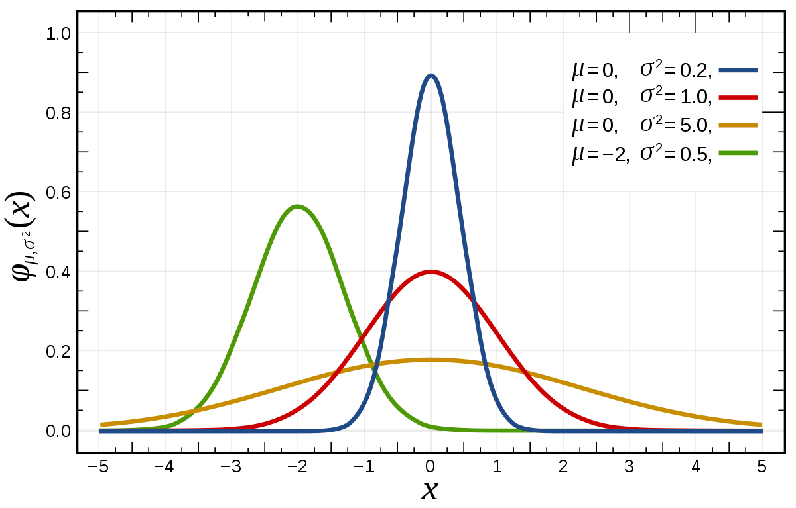

# CARUSO METRIC

## Socials
- ✖️ [Twitter](https://twitter.com/FHuzjan) 
- 💼 [LinkedIn](https://www.linkedin.com/in/franhuzjan/)

## Original distributions

**NBA Fantasy:** A source of pure joy and stress for most of us. If you're reading this, it means you're deep into it, and you probably know that there are two types of NBA Fantasy leagues: points and categories. Categories typically require more strategy and planning, making them the more popular choice, with the most popular being 9CAT league.

The categories are
- Points
- Three pointers
- Rebounds
- Assists
- Steals
- Blocks
- Turnovers
- Field goal percentage
- Free throw percentage

For the past 30 years or so, the golden standard for NBA fantasy category rankings has been the Z-score. Every year, we draft, rank, and evaluate players based on their Z-score ranking. But have you ever questioned how that rank is calculated? Probably not, just like myself.

I was listening to [Josh Lloyd's](https://twitter.com/redrock_bball) podcast, where he was discussing how the Z-score is calculated. It essentially assumes that the data distribution is Gaussian or Normal. I thought to myself, well, almost everything becomes normally distributed when the sample size is large enough, and in the NBA, we're dealing with thousands and thousands of shots, steals, blocks, and more.

Z-score is being calculated with the following formula:

Z = (X - μ) / σ

Where:
- Z is the Z-score,
- X is the value you want to standardize,
- μ is the mean (average) of the data,
- σ is the standard deviation of the data.

and the data is the values from all players for a specific category.

Okay sounds good for now, but Josh said that the data is not normally distributed. I can't trust him blindly, so I decided to plot the main 9 categories all for all top180 players based on traditional Z-score, and their distributions.

Well, well, looks like he was right all along. None of this data looks like Gaussian distribution. Maybe Z-score isn't the best metric available. Maybe that is the reason why last season players like Delon Wright, Al Horford, De'Anthony Melton had higher rank than the 2x MVP Giannis Antetokounmpo. 

Btw really interesting tweet by Josh:
<blockquote class="twitter-tweet">
JJJ had a z score of 4.64 for blocks category last season. In a normally distributed set of data, someone being that far above is a 1 in about half a million proposition.
&mdash; Josh Lloyd (@redrock_bball) <a href="https://twitter.com/redrock_bball/status/1690974327620227072?ref_src=twsrc%5Etfw">August 14, 2023</a></blockquote> 

A player that averages 3.0 blocks per game, should be THAT rare. There have been plenty of players in the past who have averaged even more. 

### Header 3
